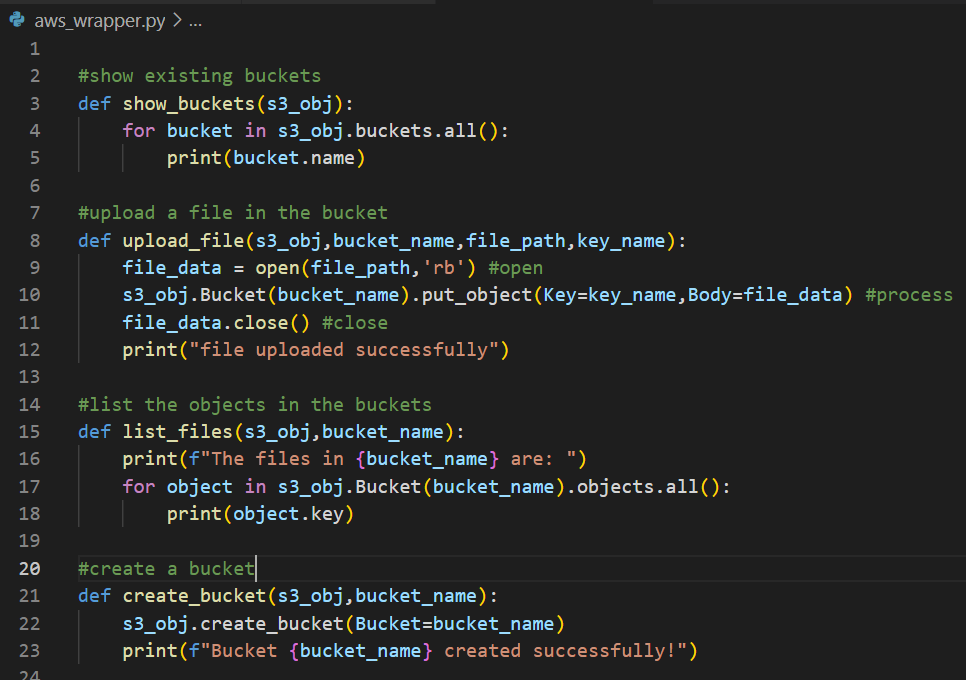
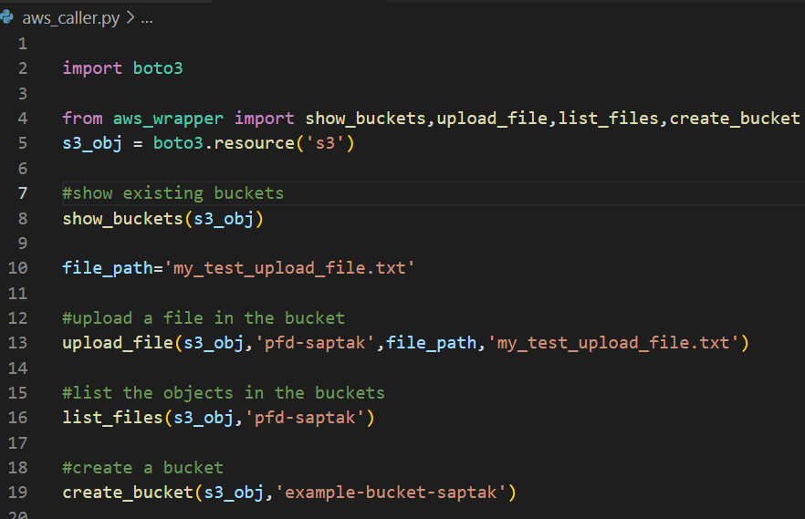
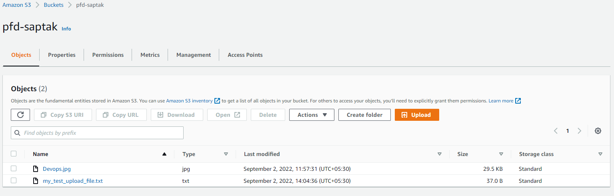
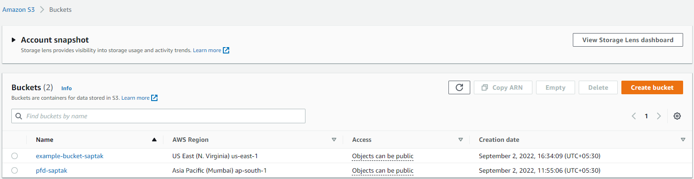

## About the project

The idea is to automate different operations in Amazon s3 using boto3.

Boto3 is an AWS SDK for python that provides a Python API for AWS infrastructure services.
## Working
The following wrapper functions are used to automate the tasks:

These functions are then called on another python file:

Uploaded two files in the bucket 'pfd-saptak':

 
Created the bucket 'example-bucket-saptak':

